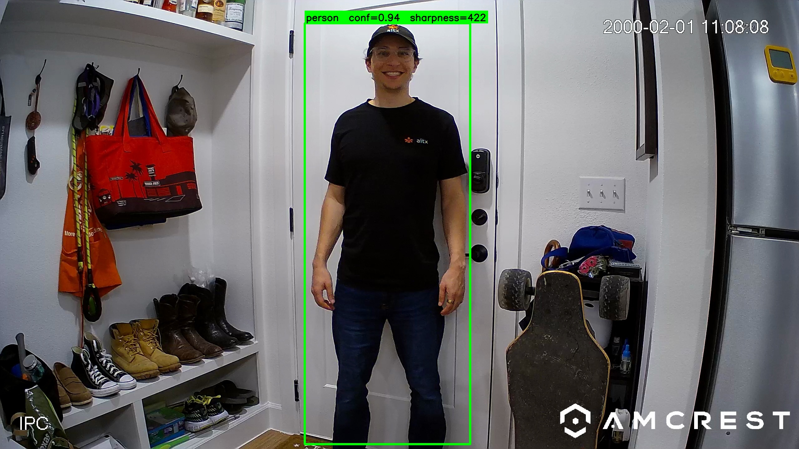
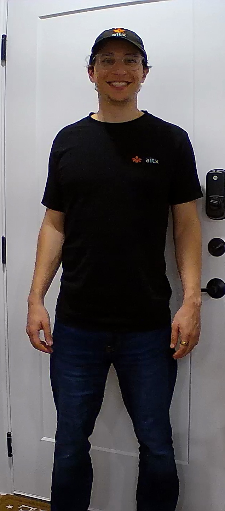

# Digital Wardrobe PoC

A "what did I wear today" log driven by a static IP camera pointed at a front
door. Built as a weekend learning project on top of
[yolo-mlx](https://github.com/thewebAI/yolo-mlx) (installed from PyPI).

The four phases below only depend on the public `yolo26mlx` API
(`from yolo26mlx import YOLO`), so this repo stays decoupled from yolo-mlx
internals.

## Pipeline

```
[Amcrest IP camera, RTSP]
        │
        ▼
  capture.py ──── yolo26n detection + ByteTrack ──── entry-event detection
        │              │
        │              ├── per track: keep top-K candidate frames
        │              │   ranked by area × confidence × sharpness
        │              │   (Laplacian variance — picks still moments
        │              │   over peak-motion walk-bys)
        │              │
        │              └── on track close → save K crops + append event row
        ▼
wardrobe/data/events.jsonl + wardrobe/data/crops/*.jpg
        │
        ▼
  analyze.py ──── group events into bursts (default ±5 min)
        │              │
        │              ├── pool all candidate crops in the burst
        │              ├── pick top-N by sharpness for Claude vision
        │              └── send to Claude Sonnet 4.6 with structured-output schema
        ▼
wardrobe/data/outfits.jsonl  (one record per burst)
        │
        ▼
  dedup.py ──── per Piece in each burst:
        │              │
        │              ├── embed `"{color} {pattern} {type}"` with
        │              │   sentence-transformers MiniLM (384-dim, local)
        │              ├── match against existing cluster centroids
        │              │   of the same slot by cosine similarity
        │              └── if best_sim ≥ --threshold (0.89): JOIN cluster
        │                  else: open NEW cluster with stable id (shirt_004)
        ▼
wardrobe/data/clusters.jsonl  (one record per distinct piece)
        │
        ▼
  report.py ──── render a self-contained static HTML page
        │              │
        │              ├── header with stats (pieces / outfits / wears)
        │              ├── wardrobe catalog: per-slot cluster cards with
        │              │   representative crops + wear-count dot rows
        │              └── outfit timeline: per-burst card with thumbnails
        │                  + piece chips linked to cluster IDs
        ▼
wardrobe/data/report.html  (open in browser; --inline for a shareable single file)
```

All four phases are functional end-to-end.

## Worked example

A single entry event from the test corpus, end-to-end.

**1. Full frame from the RTSP stream** — yolo26n + ByteTrack detect the
person and emit a bounding box. Box drawn in green; the label shows the
detection confidence and Laplacian-variance sharpness score at that frame:



**2. Padded crop** (10% on each side, clipped to frame bounds) — this is
what gets saved to `wardrobe/data/crops/` and later sent to Claude vision:



The crop above is `wardrobe/data/crops/20260524_214904_3_2_crop.jpg` —
the rank-2 candidate from track #3, captured at `2026-05-24T21:49:04`
(person paused at the door). The 117-frame track produced 3 candidate crops,
ranked by `area_frac × confidence × sharpness`:

| Rank | Bbox `[x1, y1, x2, y2]` | Confidence | Area frac | Sharpness |
|---|---|---|---|---|
| 0 | `[ 444,  5, 1100, 1425]` | 0.944 | 25.3% | 413.8 |
| 1 | `[ 902, 63, 1436, 1427]` | 0.948 | 19.8% | 417.5 |
| **2 (shown)** | `[ 976, 74, 1506, 1424]` | 0.943 | 19.4% | **422.5** |

All three candidates sit above 400 sharpness (typical motion-blur frames
score under 50) because the per-frame scoring picked moments when the
person was stationary at the door, not the peak-motion walk-by frames.
Rank 0 has the largest bbox but slightly lower sharpness; ranks 1 and 2
are slightly tighter but sharper. Claude gets all three to synthesize from.

The 3 candidate crops became one entry in `events.jsonl`, then `analyze.py`
grouped this single event into burst `20260524_214904`, sent all 3 crops to
Claude vision, and produced this outfit record:

> **one_line_summary**: *"black graphic tee with 'aitx' logo, dark navy
> jeans, matching branded navy cap, clear-frame glasses, gold ring"*
>
> **confidence**: high

| Slot | Type | Color | Pattern | Notes |
|---|---|---|---|---|
| shirt | crewneck t-shirt | black | graphic_logo | small left-chest 'aitx' logo with orange icon |
| pants | jeans | dark navy blue | solid | straight/slim fit, no distressing |
| accessory | baseball cap | dark navy blue | graphic_logo | matching orange graphic; appears to be a matched set with the shirt |
| accessory | glasses | — | — | thin clear/light frames |
| accessory | ring | — | — | gold band on right hand |

> **notes**: *"All three angles provide good coverage; lighting is consistent
> and colors read reliably. Cap color appears very close to the shirt — both
> dark navy, possibly intentional matched set."*

This call cost **~$0.017** (3940 input + 1700 cache-read + 282 output
tokens at Sonnet 4.6 prices). The 1700 cache-read tokens are the system
prompt — already in cache from a previous call within the 5-min TTL window,
about 20% cheaper than a cold call. In Phase 3, each of the 5 pieces above
will get matched against pieces from other bursts to build a clustered
catalog of distinct garments the user owns.

## Setup

One-time, from the repo root:

```bash
# Install runtime deps (yolo-mlx[tracking] + anthropic + pydantic + sentence-transformers)
uv sync

# Camera credentials — preferred form, raw password (script URL-encodes it):
cp wardrobe/.env.example wardrobe/.env
# then edit wardrobe/.env and set RTSP_USER, RTSP_PASS, RTSP_HOST

# Sanity-check the camera stream (reads one frame; no model loaded)
uv run python wardrobe/capture.py --check
# expected: OK stream readable: 2560x1440  ((1440, 2560, 3))
```

## Quick start

```bash
# 1. Capture entry events (leave running — e.g. in a tmux session)
uv run python wardrobe/capture.py --show          # live preview, q to quit
uv run python wardrobe/capture.py                  # headless

# Walk past the door a few times. Each pass becomes an event in
# wardrobe/data/events.jsonl, with K=3 candidate crops saved per event.

# 2. Analyze each burst into a structured outfit record
uv run python wardrobe/analyze.py                  # processes new bursts only
uv run python wardrobe/analyze.py --dry-run        # see what would be sent, no API call

# 3. Cluster pieces into a wardrobe catalog of distinct garments
uv run python wardrobe/dedup.py                    # incremental, processes new pieces
uv run python wardrobe/dedup.py --report           # print catalog summary

# 4. Render an HTML report
uv run python wardrobe/report.py --open            # writes report.html and opens it
```

Outputs land in `wardrobe/data/outfits.jsonl`, `wardrobe/data/clusters.jsonl`,
and `wardrobe/data/report.html`.

## Configuration

### Camera RTSP (`wardrobe/.env`)

Preferred form — paste the raw password; the script URL-encodes special
characters (`@:#&%` etc.) for you:

```env
RTSP_USER=admin
RTSP_PASS=your-raw-password-here
RTSP_HOST=192.168.1.108
# Optional, defaults shown:
# RTSP_PORT=554
# RTSP_PATH=/cam/realmonitor?channel=1&subtype=0  # Dahua/Amcrest main stream
```

Alternative if your camera needs a non-standard path: set `RTSP_URL=` directly
(must already be URL-encoded).

### Anthropic API key

`ANTHROPIC_API_KEY` is read from your shell environment first, then from
`wardrobe/.env` as a fallback. Recommended for solo use:

```bash
# In ~/.zshrc (or equivalent):
export ANTHROPIC_API_KEY="sk-ant-..."
```

Storing it in `wardrobe/.env` works too (the `.env` file is gitignored).

### `capture.py` flags

| Flag | Default | Purpose |
|---|---|---|
| `--source` | env-built | RTSP URL, video file, or webcam index. Falls back to env. |
| `--model` | `models/yolo26n.npz` | MLX detection weights |
| `--check` | off | Open source, read one frame, print shape, exit |
| `--show` | off | Live cv2 preview window (q to quit) |
| `--conf` | `0.3` | Detection confidence threshold |
| `--imgsz` | `640` | Inference image size (bump to 1280/1440 for distant detections) |
| `--min-frames` | `10` | Drop tracks shorter than this (transient noise) |
| `--lost-frames` | `30` | Close a track after N consecutive frames missing (~1 sec at 30 fps) |
| `--min-area-frac` | `0.05` | Drop tracks whose best frame has a tiny person box |
| `--pad` | `0.1` | Padding around the person bbox when cropping |
| `--top-k` | `3` | Save top-K candidate frames per track. Lower for less disk usage. |
| `--output` | `wardrobe/data` | Output directory |

### `analyze.py` flags

| Flag | Default | Purpose |
|---|---|---|
| `--events` | `wardrobe/data/events.jsonl` | Capture-event input |
| `--outfits` | `wardrobe/data/outfits.jsonl` | Outfit-record append-only output |
| `--window` | `300` | Burst window in seconds — events within this gap merge into one burst |
| `--max-images` | `4` | Maximum candidate crops to send to Claude per burst |
| `--dry-run` | off | Print bursts + which crops would be sent. No API calls. |
| `--reprocess` | off | Re-analyze bursts already present in `outfits.jsonl` |

### `dedup.py` flags

| Flag | Default | Purpose |
|---|---|---|
| `--outfits` | `wardrobe/data/outfits.jsonl` | Outfit records input |
| `--clusters` | `wardrobe/data/clusters.jsonl` | Cluster catalog input/output |
| `--threshold` | `0.89` | Cosine similarity threshold for joining an existing cluster |
| `--reset` | off | Wipe `clusters.jsonl` and rebuild from scratch |
| `--dry-run` | off | Simulate cluster decisions without writing the catalog |
| `--report` | off | Print catalog summary and exit |

Dedup runs fully locally — no API calls. Uses `sentence-transformers`
(MiniLM, 384-dim) which downloads ~80 MB on first run and caches under
`~/.cache/huggingface/`. Subsequent runs are instant after model load.

### `report.py` flags

| Flag | Default | Purpose |
|---|---|---|
| `--outfits` | `wardrobe/data/outfits.jsonl` | Outfit records input |
| `--clusters` | `wardrobe/data/clusters.jsonl` | Cluster catalog input |
| `--output` | `wardrobe/data/report.html` | Output HTML path |
| `--inline` | off | Base64-embed all images into the HTML — single shareable file (~MB per crop) |
| `--open` | off | Open the report in the default browser after writing |

Pure Python stdlib + `html.escape` for safety. No web framework, no JS,
no build step. The default output references images by relative path
(`crops/...jpg`), which works when opened directly in a browser from
`wardrobe/data/`. Pass `--inline` if you want to email or post the
single HTML file.

## Data layout

Everything under `wardrobe/data/` is gitignored.

```
wardrobe/data/
├── events.jsonl                                 # one line per entry event
├── outfits.jsonl                                # one line per analyzed burst
├── clusters.jsonl                               # one line per distinct piece
├── report.html                                  # static HTML browse view
└── crops/
    ├── <stamp>_<trackid>_<rank>_full.jpg        # full frame at candidate moment
    └── <stamp>_<trackid>_<rank>_crop.jpg        # padded person bbox crop
```

`rank=0` is the best candidate per track (sharpest within the area × conf
quality gate); `rank=1` and `rank=2` are runners-up kept for redundancy and
angle diversity.

### Event schema (`events.jsonl`)

```json
{
  "ts": "2026-05-24T21:05:55",
  "track_id": 384,
  "duration_frames": 92,
  "n_frames_seen": 92,
  "best_conf": 0.94, "bbox": [...], "area_frac": 0.41, "sharpness": 312.5,
  "full_path": "wardrobe/data/crops/20260524_210555_384_0_full.jpg",
  "crop_path": "wardrobe/data/crops/20260524_210555_384_0_crop.jpg",
  "candidates": [
    {"rank": 0, "full_path": "...", "crop_path": "...", "bbox": [...],
     "conf": 0.94, "area_frac": 0.41, "sharpness": 312.5, "score": 120.5},
    {"rank": 1, ...},
    {"rank": 2, ...}
  ]
}
```

Top-level `best_conf` / `bbox` / `crop_path` / etc. mirror `candidates[0]` for
back-compat. Older events (captured before sharpness scoring was added) omit
the `candidates` array; `analyze.py` transparently treats them as
single-candidate events.

### Outfit schema (`outfits.jsonl`)

```json
{
  "burst_id": "20260524_210144",
  "burst_start_ts": "2026-05-24T21:01:44",
  "burst_end_ts": "2026-05-24T21:02:21",
  "member_event_count": 2,
  "member_crops": [...top N picked from the burst's candidate pool...],
  "model": "claude-sonnet-4-6",
  "outfit": {
    "pieces": [
      {"slot": "shirt", "type": "graphic crewneck t-shirt",
       "primary_color": "black", "pattern": "graphic_logo",
       "notes": "white text on chest"},
      {"slot": "pants", "type": "jeans", "primary_color": "dark indigo blue",
       "pattern": "solid", "notes": null}
    ],
    "one_line_summary": "black graphic tee, dark indigo jeans",
    "confidence": "medium",
    "notes": "Lighting consistent across frames..."
  },
  "usage": {"input_tokens": 4657, "output_tokens": 252,
            "cache_creation_input_tokens": 1700, "cache_read_input_tokens": 0},
  "latency_seconds": 8.0,
  "analyzed_at": "2026-05-24T21:10:00"
}
```

Slots are intentionally flat (one `Piece` per garment/accessory) so that
Phase 3 can cluster pieces independently across bursts. The set of slots is
`{shirt, pants, accessory}` today. **Shoes is a TODO** — the front-door
camera angle cuts off below the knee. See the `Slot` literal in `analyze.py`.

### Cluster schema (`clusters.jsonl`)

One record per distinct piece in your wardrobe. `members` lists every burst
that piece appeared in; `wear_count` is `len(members)`.

```json
{
  "cluster_id": "shirt_004",
  "slot": "shirt",
  "canonical_label": "black graphic_logo crewneck t-shirt",
  "user_label": null,
  "wear_count": 1,
  "first_seen": "2026-05-24T21:49:04",
  "last_seen": "2026-05-24T21:49:04",
  "representative_crop": "wardrobe/data/crops/20260524_214904_3_0_crop.jpg",
  "members": [
    {"burst_id": "20260524_214904", "burst_ts": "2026-05-24T21:49:04",
     "piece_idx": 0, "type": "crewneck t-shirt", "primary_color": "black",
     "pattern": "graphic_logo",
     "notes": "small left-chest logo reading 'aitx'",
     "text": "black graphic_logo crewneck t-shirt"}
  ],
  "centroid": [0.012, -0.044, 0.087, ...]  // 384 floats
}
```

Cluster IDs are stable across re-runs (`shirt_001`, `shirt_002`, ...). The
`centroid` is the running mean of normalized MiniLM embeddings across members
— stored in the file so re-runs can match new pieces without re-embedding the
existing corpus. `user_label` is reserved for a future manual-rename flow.

### Sample `--report` output

```
Wardrobe catalog: 10 distinct piece(s) across 7 outfit(s), 24 total wear(s).

accessories (4):
  accessory_003   glasses                                  worn 4×  last=2026-05-24 21:49
  accessory_002   ring                                     worn 3×  last=2026-05-24 21:49
  accessory_001   olive green solid baseball cap           worn 2×  last=2026-05-24 21:25
  accessory_004   dark navy blue graphic_logo baseball cap worn 1×  last=2026-05-24 21:49

pants (2):
  pants_002       dark navy blue solid jeans               worn 6×  last=2026-05-24 21:49
  pants_001       light gray solid sweatpants              worn 1×  last=2026-05-24 16:43

shirts (4):
  shirt_001       navy blue solid crewneck t-shirt         worn 4×  last=2026-05-24 21:25
  shirt_004       black graphic_logo crewneck t-shirt      worn 1×  last=2026-05-24 21:49
  shirt_003       slate blue graphic_logo crewneck t-shirt worn 1×  last=2026-05-24 21:15
  shirt_002       green graphic_logo crewneck t-shirt      worn 1×  last=2026-05-24 20:48
```

## Cost

- **capture.py**: free — local MLX inference on Apple Silicon.
- **analyze.py**: one Claude vision call per burst, ~2–4 images attached.
  ≈ $0.02–0.03 per burst on Claude Sonnet 4.6 (input + cache write + output).
  Cache hits within the same 5-minute TTL window cut subsequent calls by ~20%
  (`cache_read_input_tokens` > 0). At 5–10 bursts/day → **~$0.10–0.30/day**.
- **dedup.py**: free — local sentence-transformers embeddings. One-time
  ~80 MB model download on first run; cached afterwards. Inference is
  millisecond-fast.
- **report.py**: free — pure stdlib HTML rendering. Runs in well under
  a second on hundreds of outfits.

## Known caveats

- **Camera angle determines what's tracked.** Shoes need the camera angled
  down enough to see the floor at door distance. The framing matters more
  than the model.
- **Auto white balance in IR/transitional light** can introduce a color cast.
  Set the camera's WB to "Indoor" in the web UI; the script doesn't post-process
  colors.
- **The model's predictor converts BGR → RGB internally** for `orig_img` —
  `capture.py` correctly converts back to BGR for `cv2.imwrite` so saved
  crops are color-correct. Don't change either side without re-syncing.
- **Burst window default (5 min) handles typical in-and-out patterns** but
  may merge two outfits if you change in <5 min and immediately walk past.
  Pass `--window 60` for aggressive splitting during rapid testing.

## Roadmap

The four PoC phases are functional. Future work, roughly in order of
"how much more would this make the system feel real":

- **Calendar view** in the HTML report: a month grid where each day shows
  the outfit you wore. Already have the data (`burst_start_ts` + cluster IDs);
  needs ~50 lines of HTML/CSS.
- **Manual cluster operations**: rename (`user_label` is already reserved),
  split (move members from one cluster to a new one), merge (collapse two
  clusters into one). The dedup script's centroid recomputation would need
  to handle these.
- **Better wear-count fidelity**: today, accessory `wear_count`s under-count
  because Claude only sees items when they're visible from the captured
  angle. Could be fixed by tracking a "person identity" across bursts and
  treating accessories as persistent unless explicitly absent — but that
  needs face-ID or some other identity signal.
- **Vision embeddings for dedup**: text-only clustering handles same-color-
  different-cut edge cases poorly (two black tees with different silhouettes
  look identical textually). Per-piece CLIP embeddings would help, but
  require per-piece bboxes the current capture doesn't produce.
- **Daemonize capture.py** with launchd/systemd so it survives reboots and
  auto-restarts on the camera dropping its RTSP stream.

## TODOs

Concrete things to pick off, grouped roughly by effort. The Roadmap above
is the narrative version; this is the checkbox version.

### Quick wins (≈1 hr each)

- [ ] Extract the duplicated `_load_jsonl()` and `_load_dotenv()` helpers
      into a shared `wardrobe/_io.py` — currently copy-pasted across all
      four scripts.
- [ ] `--watch` mode on `analyze.py` and `dedup.py` for continuous
      processing instead of manual re-runs.
- [ ] `--check` flag on `analyze.py` that verifies `ANTHROPIC_API_KEY` is
      set and one Claude vision call round-trips before the first burst —
      mirrors `capture.py --check`.
- [ ] Re-canonicalize `events.jsonl` utility — in case an editor re-pretty-
      prints it, run something like `wardrobe/canonicalize.py events.jsonl`.
- [ ] Camera NTP check — the Amcrest clock drifted to "2000-02-01" at one
      point in testing. Confirm NTP is enabled in the web UI.

### Real features (≈half a day each)

- [ ] **Enable the shoes slot** once the camera framing reliably captures
      feet. See the `Slot = Literal[...]` TODO block in `analyze.py` for
      exactly what to change.
- [ ] **Color palette band** in the report, weighted by per-piece wear count.
      "What color is your wardrobe?"
- [ ] **"Last worn"** sortable table — for "what haven't I worn in 30 days?"
      All the data is in `clusters.jsonl`'s `last_seen` field.
- [ ] **Per-cluster detail page** showing every crop a piece has appeared
      in, with a date strip. Linked from the cluster card in the catalog.
- [ ] **Client-side search** in the report — JS filter over outfit
      `one_line_summary` and piece labels.
- [ ] **Manual cluster ops** — `dedup.py --rename shirt_001 "work navy
      tee"`, `--split shirt_002 <member_id>`, `--merge shirt_001 shirt_004`.
      Sets `user_label` and recomputes centroids.

### Production-ish (≈day+ each)

- [ ] **Daemonize `capture.py`** via launchd so it survives reboots and
      auto-restarts on RTSP drops (currently lives in a tmux session you
      have to remember to restart).
- [ ] **Retention policy** — auto-prune crop JPEGs after they're analyzed
      AND every candidate has been clustered, keeping one representative
      crop per cluster forever. Today, every entry pass keeps 3 JPEGs.
- [ ] **Cost monitoring** — daily Claude spend logger with a configurable
      warning threshold. Today: cost is in each `outfits.jsonl` record but
      not aggregated anywhere.
- [ ] **Minimal pytest suite** for the deterministic bits: `piece_text()`
      canonicalization, burst grouping windows, JSONL back-compat shim,
      sharpness scoring on a synthetic blur/sharp pair.

### Data hygiene

- [ ] **Retroactively swap R/B** on the pre-fix crops from the 16:43 burst
      (analysis already happened with the wrong channels — purely cosmetic).
- [ ] **PII inventory** — document exactly what's in `events.jsonl` /
      `outfits.jsonl` so future-you knows what's safe to share publicly.
### Stretch / research

- [ ] **Vision embeddings for dedup (CLIP)** — handles same-color-different-
      cut edge cases that text-only misses. Requires per-piece bboxes, which
      the current capture doesn't produce.
- [ ] **Multi-occupant support** — currently assumes one person; would need
      face-ID or some persistent identity signal to attribute outfits to the
      right wardrobe.
- [ ] **Weather correlation** — pull from NWS / OpenWeather to see what you
      wear at what temperature. Bonus: "you usually wear a jacket below 12°C
      but today's 8°C and you didn't grab one."
- [ ] **Calendar UI in the report** — month grid where each day shows the
      outfit worn. Already have the data (`burst_start_ts` + cluster IDs);
      needs ~50 lines of HTML/CSS.
